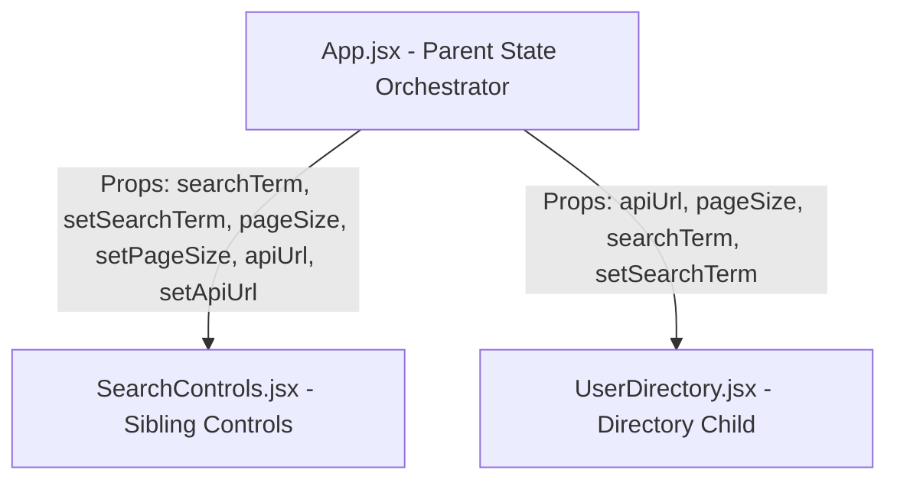

# Live Search User Directory (React + Vite)

A modern, responsive React directory application that demonstrates core React concepts including state management, props, custom styling with CSS variables/glassmorphism, and multiple distinct `useEffect` hook patterns (fetching, debouncing with cleanup, abort controllers, and document title synchronization).

---

## Technical Stack & Aesthetics

- **Core**: React 18, Vite 6 (JavaScript)
- **Styling**: Vanilla CSS featuring a premium "deep-space" dark theme, responsive CSS Grids, skeleton shimmer effects for loading states, and custom gradient initials for avatars.
- **Data Source**: Live JSONPlaceholder Users API (`https://jsonplaceholder.typicode.com/users`).

---

## Component Architecture & State Flow

The application demonstrates the "Lifting State Up" pattern, letting sibling components interact and modify state parameters reactively:



### 1. Parent: [App.jsx](file:///c:/Users/naree/New%20Folder/user-directory/src/App.jsx)
- Orchestrates shared state:
  - `apiUrl`: Holds the endpoint URL (toggles between standard endpoint and a failing endpoint to show error state).
  - `pageSize`: Configures how many users to display at once (3, 5, 10, 15).
  - `searchTerm`: Captures matching characters for live-searching users by name.
- Renders the child components, passing down these variables and setters as props.

### 2. Sibling Component: [SearchControls.jsx](file:///c:/Users/naree/New%20Folder/user-directory/src/components/SearchControls.jsx)
- Renders the search bar input.
- Renders selection menus to modify `pageSize` and switch the active `apiUrl`.
- Renders a **"Clear Search"** action button (only when search contains text) to demonstrate resetting parent state from a sibling.

### 3. Child Component: [UserDirectory.jsx](file:///c:/Users/naree/New%20Folder/user-directory/src/components/UserDirectory.jsx)
- Tracks independent query-based states:
  - `users`: Stores raw user array fetched from the backend.
  - `loading`: Tracks loading state to switch between skeletons and content.
  - `error`: Stores database and HTTP fetch error strings.
  - `retryTrigger`: Triggers fetch effects on request retries.
- Performs logic:
  - Filters users by matching `user.name` against `searchTerm` (case-insensitive).
  - Slices the array to respect the `pageSize` prop constraint.
  - Formats user avatars using dynamic CSS gradients based on user IDs.

---

## Core Hooks Explanations

### Effect #1 — Fetching on Mount & Cleanup (`AbortController`)
Performs standard fetches whenever the `apiUrl` prop changes. To prevent race conditions from rapid toggles or typing, we return a cleanup function containing `controller.abort()` to discard older requests:
```javascript
useEffect(() => {
  const controller = new AbortController();
  const { signal } = controller;

  async function fetchUsers() {
    setLoading(true);
    setError(null);
    try {
      const response = await fetch(apiUrl, { signal });
      if (!response.ok) throw new Error("HTTP error status");
      const data = await response.json();
      setUsers(data);
    } catch (err) {
      if (err.name !== 'AbortError') {
        setError(err.message || 'Fetch failed.');
      }
    } finally {
      if (!signal.aborted) setLoading(false);
    }
  }

  fetchUsers();
  return () => controller.abort(); // Cleanup/Abort in-flight request!
}, [apiUrl, retryTrigger]);
```

### Effect #2 — Debounced Search Logging (`clearTimeout`)
Debounces heavy processes or analytical logs to prevent console spam. Whenever the `searchTerm` updates, a 500ms timeout starts. If the user continues typing, the cleanup function clears the previous timeout immediately:
```javascript
useEffect(() => {
  const timer = setTimeout(() => {
    console.log(`Searching for: ${searchTerm}`);
  }, 500);
  
  return () => clearTimeout(timer); // Cleanup cancels stale timers!
}, [searchTerm]);
```

### Effect #3 — Document Title Synchronizer
Updates the tab's metadata title reactively whenever the visible list or matching results count updates:
```javascript
useEffect(() => {
  document.title = `Users: ${displayedUsers.length} shown of ${filteredUsers.length}`;
}, [displayedUsers.length, filteredUsers.length]);
```

---

## Installation & Setup

Navigate into the project subdirectory and run:

```bash
# Install dependencies
npm install

# Start the local development server (typically on http://localhost:5173/)
npm run dev

# Compile production bundle
npm run build
```
